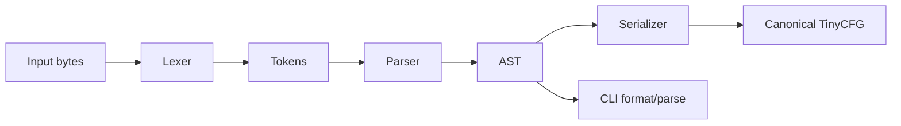

# Architecture

ByteHound implements **TinyCFG**, a small configuration language parsed by a dependency-free C++20 library.

## Components



### Lexer

The lexer scans the full input span (including embedded NUL bytes) and emits typed tokens. It skips whitespace and `#` / `//` comments. Strings support `\"`, `\\`, `\n`, `\t`, `\r`, and `\0` escapes. Numbers are classified as integers or floats at lex time.

Lexical failures return `ParseResult` with line/column metadata.

### Parser

A recursive-descent parser consumes token streams produced by the lexer. Top-level syntax is a sequence of named sections:

```text
section_name { key = value; ... }
```

Nested objects reuse the same `key = value;` assignment form inside `{ ... }`. Arrays use `[ value, value, ... ]`.

**Duplicate key policy:** within an object, later assignments overwrite earlier ones (last-wins).

### AST ownership

`Document` is `std::map<std::string, Object>` where `Object` is `std::map<std::string, Value>`. `Value` is a `std::variant` over null, bool, int64, double, string, array, and nested object. Containers use value semantics; moves are used during parsing and mutation fuzzing.

`structural_equal` compares ASTs independent of map iteration order.

### Serializer

The serializer emits deterministic, canonical TinyCFG:

- one assignment per line inside blocks
- stable key ordering via `std::map`
- minimal escaping for strings
- integers via `std::to_chars`
- floats with sufficient precision and `.0` suffix for whole-number floats

### Error handling

Errors are returned as `ParseResult` values. The CLI and fuzz harnesses treat expected parse failures as normal control flow. Unexpected exceptions or sanitizer findings indicate bugs.

### Parser limits

Defined in `include/tinycfg/limits.hpp`:

| Limit | Default |
|-------|---------|
| Input bytes | 1 MiB |
| Nesting depth | 64 |
| Token count | 100,000 |
| String bytes | 64 KiB |
| Container entries | 10,000 |
| Identifier bytes | 256 |

Violations produce parse errors; they must not crash or recurse indefinitely.

### Fuzzing boundaries

| Harness | Exercises |
|---------|-----------|
| `fuzz_lexer` | Tokenization, comment/escape edge cases, limits |
| `fuzz_parser` | End-to-end parse errors and valid configs |
| `fuzz_roundtrip` | Parse → serialize → parse equality |
| `fuzz_mutation_sequence` | AST mutation, ownership, repeated serialize/parse |

Harnesses reject oversize inputs early. They do not catch sanitizer failures.

### Educational legacy fixture

`training/legacy_parser/` is isolated behind `TINYCFG_ENABLE_LEGACY_TRAINING_FIXTURE`. It is not linked into default builds.
